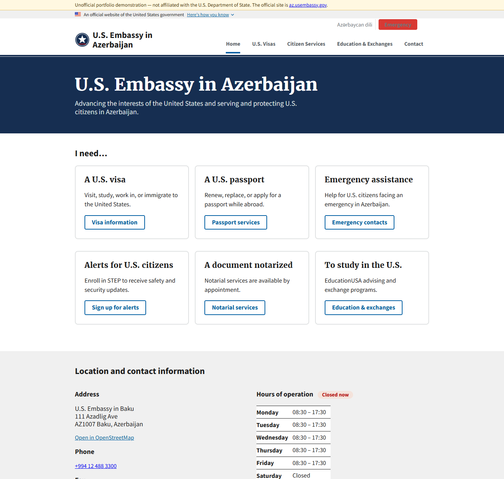
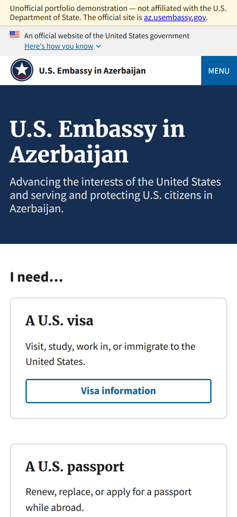
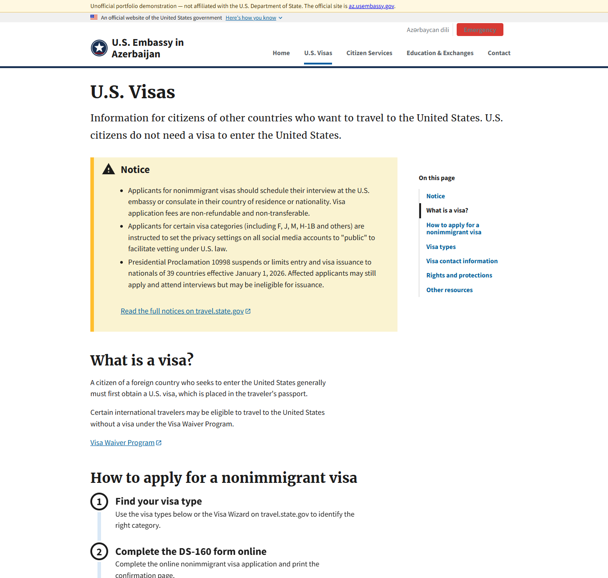

# Embassy Site Rebuild — a U.S. Web Design System case study

A from-scratch rebuild of four pages from the public **U.S. Embassy in Azerbaijan** website
(az.usembassy.gov), built to the standards federal sites are supposed to meet:
the [U.S. Web Design System](https://designsystem.digital.gov/), Section 508 / WCAG 2.1 AA
accessibility, and basic web security hygiene — with a measured before/after.

> **Unofficial portfolio project.** Not affiliated with the U.S. Department of State.
> The site content is U.S. Government work (public domain); the Azerbaijani text is my own
> translation and would need native-speaker review before real use.

| | Original (live, mobile emulation) | Rebuild |
|---|---:|---:|
| Lighthouse Performance | 55 | **94** |
| Lighthouse Accessibility | 85 | **100** |
| Lighthouse Best Practices | 71 | **100** |
| Lighthouse SEO | 92 | **100** |
| Bytes transferred (home page) | 9.0 MB | **0.3 MB** |
| Network requests | 133 | **24** |
| Largest Contentful Paint | 36.5 s | **2.7 s** |
| Failing accessibility audits | 6 | **0** |

Full numbers: [audit/lighthouse-summary.md](audit/lighthouse-summary.md) ·
[audit/report.md](audit/report.md) (HTML-structure audit, all four pages).



## What was wrong with the original, and what the rebuild does about it

Everything below was measured, not eyeballed — see `tools/audit.py` and the Lighthouse reports.

| Finding in the original | Why it matters | Rebuild |
|---|---|---|
| **3 `<h1>` elements per page**, and the page's real title (e.g. "Visas") isn't one of them | Screen-reader users navigate by headings; the outline is wrong on every page | Exactly one `<h1>` per page, correct `h2`/`h3` hierarchy |
| **Content rendered several times in the DOM** — separate desktop and mobile copies plus carousel clones (12–44 duplicated blocks per page; "Read Full Biography" appears 30× in the home-page source, once on screen) | Most copies are correctly `aria-hidden`, so this is a page-weight and maintainability problem rather than a screen-reader one: the browser downloads and lays out every copy (home HTML is 269 KB vs 16 KB here), five copies are hidden only by CSS/JS, and every edit has to be made in several places | Each block rendered once; layout is responsive via CSS. 0 duplicates |
| **~370 links per page**, 308 of them a 200-country embassy dropdown rendered twice | Keyboard users tab through hundreds of links to reach content | 36–51 links per page; one link to the usembassy.gov directory |
| **69 of 84 home-page images have empty `alt`** | Most are content images, invisible to assistive tech | 15 images: 8 content photos with written alt text, 7 decorative icons marked `alt=""` |
| **9 MB / 133 requests** on the home page, 19 inline scripts | Slow on mobile networks; inline scripts prevent a strict Content-Security-Policy | 0.3 MB / 24 requests including 8 photos, 0 inline scripts, strict CSP |
| Phone numbers are plain text | Can't tap to call in an emergency | Every number is a `tel:` link; emergency box in the header, footer, and Citizen Services |
| 6 failing Lighthouse a11y audits (contrast, unnamed links, tab order, tap-target size, list markup, label mismatch) | WCAG 2.1 AA failures | 0 failing audits |

Kept from the original (parity, not new): bilingual English / Azerbaijani with `hreflang` alternates,
the official `.gov` banner, skip link, landmark structure, the travel-advisory and worldwide-caution
alert strips, embassy news, and the "I need…" quick links.

Added: "Open now / Closed now" badge computed in Baku local time, USWDS in-page navigation on long
pages, Schema.org `GovernmentOffice` structured data (address, hours, phone), print stylesheet,
HTTP security headers (`public/_headers`) with a `<meta>` CSP fallback.

### Balancing performance and design

The goal was a site that is fast *and* looks like a real embassy site — not the fastest possible page.
The rule applied: photos where they carry meaning (the home-page hero, the mission leaders, embassy
news, report covers), none where they are decoration (the original's stock "smiling travellers" banners
and the visa-tips carousel — carousels are also a known accessibility anti-pattern). Every photo is
resized and converted to WebP by `tools/optimize_images.py` at the exact widths the pages use: 3.6 MB of
source photos became 244 KB, and the home page loads about 200 KB of them. Cost of the photos in
Lighthouse terms: 3 performance points (97 → 94).

Only official U.S. Government photos were reused (public domain). The original hero image is credited to
a news agency, so it was deliberately left out.

<p>


</p>

## Stack

| Layer | Choice | Why |
|---|---|---|
| Front end | [Astro](https://astro.build/) static site + [USWDS 3](https://designsystem.digital.gov/) | Plain HTML/CSS output, no client framework; USWDS is the federal standard and does the design work |
| Content | One TypeScript file, `site/src/data/content.ts`, keyed by language | Editing text never touches a template; adding a language is one object |
| Audit / automation | Python (`tools/audit.py`) + Lighthouse + Puppeteer scripts | Repeatable, deterministic before/after measurement |
| Hosting (planned) | Cloudflare Pages or GitHub Pages | Free; Cloudflare Pages honours `_headers` for the security headers |

Cost of everything in this repo: **$0**.

## Run it

```powershell
# one-time
cd site
npm install            # also copies USWDS assets into public/uswds

# develop
npm run dev            # http://localhost:4321

# build + audit
npm run build
cd ..
pip install beautifulsoup4 lxml
pip install pillow
python tools/optimize_images.py                # photos -> site/public/img/photos/*.webp
python tools/audit.py                          # writes audit/report.md + report.json
cd site; npx astro preview                     # then, in another terminal:
node scripts/screenshot.mjs                    # audit/screenshots/*.png
npx lighthouse http://localhost:4321/ --output=json --output=html --output-path=../audit/lighthouse/rebuild-home
node ../tools/lighthouse-summary.mjs           # audit/lighthouse-summary.md
```

## Project layout

```
Source/            saved copies of the original pages (input to the audit; assets are git-ignored)
site/              the Astro site
  src/data/content.ts        all text, English + Azerbaijani
  src/layouts/Base.astro     <head>, banner, header, footer, CSP, structured data
  src/components/            USWDS-based components and the four page templates
  src/pages/                 routes: /, /visas/, /citizen-services/, /education/ and /az/… copies
  public/css, public/js      site CSS and the one small progressive-enhancement script
  public/_headers            HTTP security headers for Cloudflare Pages
  scripts/                   copy-uswds, screenshot, and overflow-measurement helpers
tools/audit.py     original-vs-rebuild HTML audit
tools/optimize_images.py   resize + WebP conversion for the photos the site uses
audit/             generated reports and Lighthouse output
docs/images/       README screenshots
```

## Roadmap

- [x] **Phase 1** — static rebuild, accessibility, security headers, measured audit (this)
- [ ] **Phase 2** — a small Python (FastAPI) service that serves alerts/advisories as JSON, fed by a
      scheduled GitHub Actions job that pulls the public travel.state.gov advisory feed and rebuilds the
      site; the audit above runs in CI on every push as an accessibility gate
- [ ] **Phase 3** — "Ask the embassy": a question box that answers only from the site's own pages,
      using a locally hosted model (Ollama) so the demo stays free and no data leaves the machine

## How the original was captured

The original pages were saved manually from a browser (`Ctrl+S` → "Webpage, Complete") rather than
scraped; usembassy.gov sits behind bot protection that blocks automated clients, and there was no
need to fight it for four pages.
