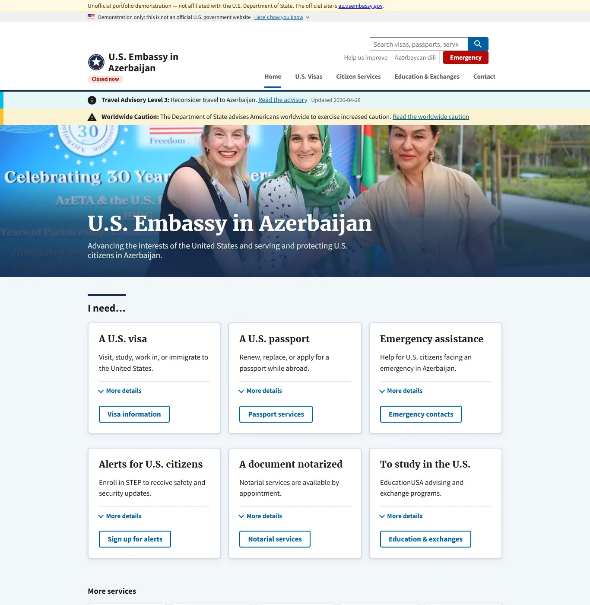
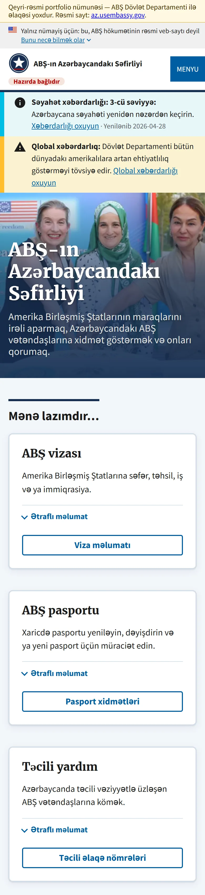
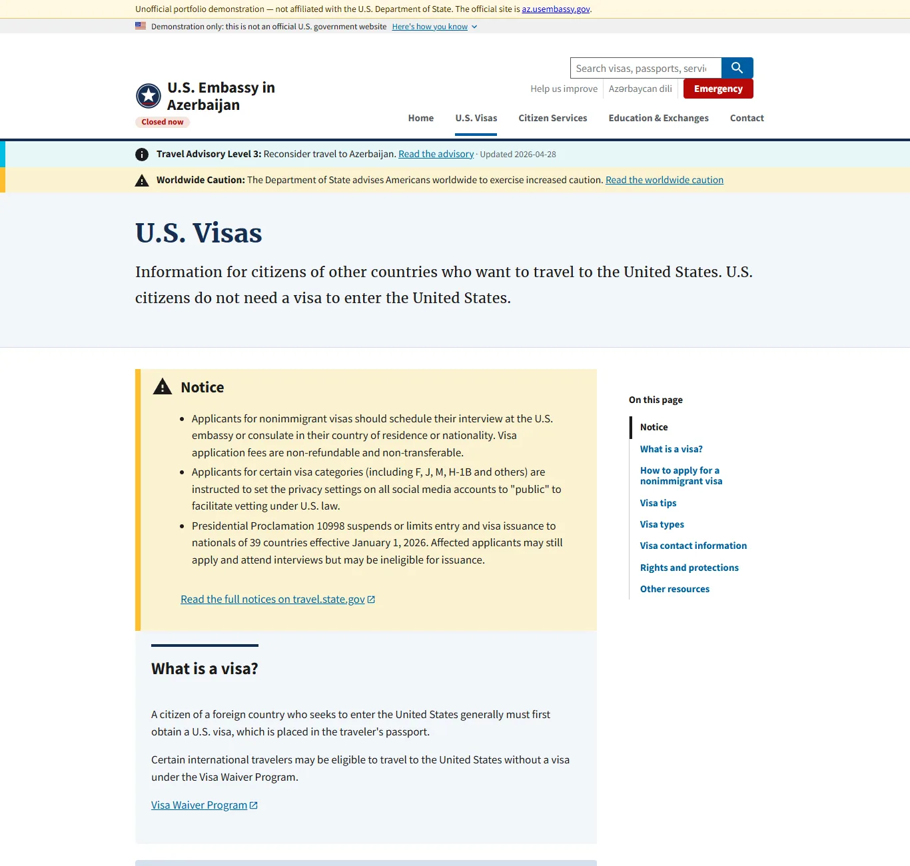

# Embassy Site Rebuild

I rebuilt four pages of the U.S. Embassy in Azerbaijan website (az.usembassy.gov) to the standards
federal sites are held to: [U.S. Web Design System](https://designsystem.digital.gov/), Section 508
/ WCAG 2.1 AA accessibility, strict Content-Security-Policy, measured before and after. The same
commit is deployed twice, on Cloudflare + Google Cloud Run and on AWS.

| | Site | API |
|---|---|---|
| Cloudflare + Google Cloud Run | [embassy-site-rebuild.ashirz.workers.dev](https://embassy-site-rebuild.ashirz.workers.dev) · [AZ](https://embassy-site-rebuild.ashirz.workers.dev/az/) | [interactive docs](https://embassy-api-394144127807.us-east4.run.app/docs) |
| AWS: S3 + CloudFront + Lambda | [d19v507gh8thmt.cloudfront.net](https://d19v507gh8thmt.cloudfront.net) | [/api/health](https://d19v507gh8thmt.cloudfront.net/api/health) · [schema](https://d19v507gh8thmt.cloudfront.net/api/openapi.json) |

> Unofficial portfolio project, not affiliated with the U.S. Department of State. Site text is U.S.
> Government work (public domain). The Azerbaijani translation is mine, reviewed by a native speaker.



## Results

Lighthouse 12, home page, repeated runs against both live sites on 2026-10-06. Both deployments
scored within a point or two of each other.

| | Original (mobile) | Rebuild, mobile | Rebuild, desktop |
|---|---:|---:|---:|
| Performance | 55 | 96–97 | 98–100 |
| Accessibility | 85 | **100** | **100** |
| Best Practices | 71 | **100** | **100** |
| SEO | 92 | **100** | **100** |
| Largest Contentful Paint | 36.5 s | 2.5–2.7 s | 0.7–1.1 s |
| Transferred / requests | 9.0 MB / 133 | 0.25 MB / 29 | 0.44 MB / 38 |
| Layout shift | – | 0 | 0 |

[securityheaders.com](https://securityheaders.com/?q=https%3A%2F%2Fembassy-site-rebuild.ashirz.workers.dev%2F)
grades both sites **A+**. Full Lighthouse reports in [audit/lighthouse/](audit/lighthouse/); the
HTML-structure comparison for all four pages is in [audit/report.md](audit/report.md).

## What was wrong with the original

Measured by `tools/audit.py` on the saved copies.

| Finding | Why it matters | Rebuild |
|---|---|---|
| 3 `<h1>` per page, none of them the page title | Screen-reader users navigate by headings | One `<h1>`, correct `h2`/`h3` structure |
| Desktop and mobile copies plus carousel clones, 12–44 duplicated blocks per page (home page HTML 269 KB) | Downloaded and laid out several times; every edit done several times | One copy, responsive CSS. Home HTML 32 KB |
| ~370 links per page (308 of them a country menu, rendered twice) | A keyboard user tabs through hundreds to reach anything | 46–62 links per page |
| 69 of 84 home-page images have empty `alt` | Content invisible to assistive tech | Content photos have alt text; captioned portraits use `alt=""` so nothing is read twice |
| 9 MB / 133 requests, 19 inline scripts | Slow on a phone; inline scripts rule out a strict CSP | 0.25 MB / 29 requests, no inline scripts, CSP of `'self'` |
| Six 1.5 MB JPEGs of visa tips with the advice baked in and no alt | Visas page 16.6 MB; screen-reader users get none of the tips | Real text with 15 KB thumbnails |
| Plain-text phone numbers | Can't tap to call in an emergency | Every number is `tel:`, with the emergency line in the phone header |
| 6 failing Lighthouse accessibility audits | WCAG 2.1 AA failures | None |

Kept: English and Azerbaijani with `hreflang`, the skip link, the advisory and worldwide-caution
strips, embassy news, and the "I need…" links. Added: an Open/Closed badge in Baku time, "On this
page" navigation, Schema.org `GovernmentOffice` data, a 404 page, link previews, and HTTP security
headers on both platforms. Carousels became plain sections, so everything is visible and reachable
by keyboard without JavaScript.

The USWDS `.gov` banner is left out: it exists to vouch for official sites. A yellow strip at the
top of every page and the footer say what this site is instead.

<p>


</p>

## One app, two clouds

Every push to `main` deploys both: to Cloudflare and Google Cloud Run (dashboards do that
themselves), and to AWS through [`deploy-aws.yml`](.github/workflows/deploy-aws.yml). The code is
one branch; the only difference is `PUBLIC_API_URL` (a full address for Cloud Run, `/api` on AWS).

| | Cloudflare + Cloud Run | AWS |
|---|---|---|
| Static site | Cloudflare Workers | S3 (private) behind CloudFront |
| API | Cloud Run container | Lambda (zip) behind CloudFront at `/api` |
| Site → API | Two origins, so CORS | One origin, no CORS at all |
| Security headers | `_headers` file | CloudFront response-headers policy |
| Infrastructure | Dashboards | CloudFormation, [`aws/cloudformation/`](aws/cloudformation/) |
| Deploy auth | Cloudflare and Google connect to GitHub | OIDC, no stored AWS keys |

Every commit on `main` has already passed CI (a repo ruleset refuses the push otherwise), and
`deploy-aws.yml` runs the whole CI suite a second time against the `/api` build before deploying.
AWS setup, cost controls and the problems I ran into are in [aws/README.md](aws/README.md).

## Stack

Astro static output + USWDS 3, Python + FastAPI backend, Pydantic validation, GitHub Actions. All
site text lives in [`site/src/data/content.ts`](site/src/data/content.ts), keyed by language.
Browser JS is four small files in [`site/public/js/`](site/public/js/) with no bundler. The CSP has
no `'unsafe-inline'` for scripts, so there is nothing to review for XSS beyond those four files.

A build step ([`trim-uswds.mjs`](site/scripts/trim-uswds.mjs)) cuts the 515 KB USWDS stylesheet to
167 KB by keeping only the components the pages use, and [`prune-uswds.mjs`](site/scripts/prune-uswds.mjs)
drops the USWDS files no built page refers to, so each deploy publishes 59 of them, not 2,600. The
site has no fingerprinted assets, so stylesheet and script URLs carry a build-time content hash
([`v()`](site/src/data/asset.ts)) and nothing is served `immutable`.

## The API

The static site works on its own: emergency numbers and the current advisory are baked into the
HTML at build. The API adds what static files can't do.

```
 travel.state.gov RSS ──daily──▶ GitHub Actions ──if changed──▶ alerts.json ──build──▶ alert strip
          │                                                           ▲
          └──────live, cached 1 h──────▶  GET /alerts  ──────fallback─┘
                                          GET /search?q=   ◀── index built with the site
                                          POST /feedback   ◀── "Help us improve" form
                                          POST /ask        ◀── local model, off in the cloud
```

| Endpoint | What it does | Notes |
|---|---|---|
| `GET /alerts?country=` | Current advisory for one country, live from the State Department feed | 1-hour cache; falls back to the bundled copy if the feed is down. Accepts ISO (AZ) and the feed's own (AJ) |
| `GET /alerts/all?level=` | Every country's current level | e.g. all Level 4 countries |
| `GET /search?q=&lang=` | Search over this site's pages | 50 entries. Title hits count 5, headings 3, body 1 |
| `POST /feedback` | "Help us improve" form | Validation, honeypot, 5/hour per IP, one JSON log line, no database |
| `POST /ask` | Grounded Q&A over the site's pages, local model only | 503 unless `OLLAMA_URL` is set, which it never is in the cloud. See [docs/ask.md](docs/ask.md) |

The daily job ([`alerts.yml`](.github/workflows/alerts.yml)) checks the feed and updates
`alerts.json` when Azerbaijan's level or date changes. Its own push can't trigger CI, so it pushes
to a side branch, runs CI there, waits, then pushes the same tested commit to `main`.

Run the API locally: `cd api && pip install -r requirements-dev.txt && python -m pytest -q` (31
tests, no network), then `uvicorn main:app --reload --port 8000` and open `/docs`.

## Security

The feedback form is the one place the public can write to the backend, so most of the thinking
went there.

| Threat | Control | Where |
|---|---|---|
| Junk or malicious input | Strict Pydantic validation: rating 1–5, message ≤ 1,000 chars, `page` must match a path on this site, unknown fields are **rejected** rather than ignored | `Feedback` model in `api/main.py` |
| Oversized requests | Over 16 KB is refused, whether or not the request declared a size, and 422 responses don't echo the input | `BodySizeLimit` middleware |
| Spam | Hidden honeypot field, 5/hour per IP | `FeedbackPage.astro`, `rate_limited()` |
| Rate-limit bypass | The client address comes from a source each platform guarantees, measured from outside with forged headers. On AWS the API also refuses any request without CloudFront's `X-Origin-Verify` header, so the public Lambda URL can't be used to skip CloudFront | `client_ip_of()`, `ORIGIN_VERIFY` |
| Cross-site request forgery | No cookies or sessions. JSON only, so a form on another site can't POST without a preflight; CORS allows one origin; CSP `form-action` limits where the page can post | `CORSMiddleware`, CSP |
| Cross-site scripting | Every value from the API is inserted with `textContent`/`createElement`, never `innerHTML`; the CSP allows no inline scripts | `search.js`, `feedback.js`, `ask.js` |
| Log injection | Whitespace collapsed, every record is one JSON line, so a message with newlines and fake JSON stays one record. Covered by `test_log_injection_is_neutralised` | `Feedback.strip_message`, `post_feedback` |
| Data exposure | No name or email asked for, no database. One JSON log line per submission | `FeedbackPage.astro`, `post_feedback` |
| Transport and framing | HTTPS and HSTS, `X-Frame-Options: DENY`, `nosniff`, strict referrer policy, `no-store` on API responses | headers on both platforms |
| Privileges | Container runs as a non-root user. Cloud Run service account has **no roles**; the Lambda role can only write its own logs | `api/Dockerfile`, IAM |

A real deployment would add a durable store with retention, a CAPTCHA if the honeypot and rate
limit stopped being enough, and a monitored log channel.

## Quality gates

CI runs on every push, and no deploy ever skips it:

- **HTML audit** of all 15 built pages: exactly one `<h1>`, no empty or skipped headings, every
  image has `alt`, no duplicated content, no inline scripts.
- **Lighthouse desktop** on every indexable page: accessibility 100, best practices and SEO ≥ 90,
  layout shift ≤ 0.1.
- **Lighthouse on a throttled phone**, three pages, same thresholds. Default simulated throttling
  misses font reflow; this is the check that catches it.
- **FastAPI tests** (31) and a check that the Docker image boots the way Cloud Run starts it.

A separate daily job [`uptime.yml`](.github/workflows/uptime.yml) checks that both live sites and
both APIs answer and serve the same build, and emails me if they don't.

## What went wrong, and what it taught me

CI was green through all of these. They were caught by looking at the live sites.

- **The Emergency button rendered at 1:1 contrast**, grey text on red, because a USWDS navigation
  style outranked the button style. Lighthouse still scored accessibility 100: its checker files
  an exact 1:1 ratio as "possibly deliberately hidden text" rather than a failure, and only
  failures count. 1.5:1 would have failed CI; 1:1 couldn't.
- **AWS visitors were stuck on an old stylesheet.** I'd marked assets `immutable` on the assumption
  they were fingerprinted, and they weren't. A CloudFront invalidation can't reach a browser cache.
  Fingerprints and a smoke-test guard now stop it recurring.
- **Mobile layout shift went from 0 to 0.25**, because CI ran only desktop Lighthouse with simulated
  throttling, where fonts arrive instantly. Font preloads fixed it, and CI now tests a throttled phone.
- **The rate limiter could be bypassed** with a forged `X-Forwarded-For`. I measured what each
  platform actually passes before fixing it: Cloud Run adds one trusted entry, AWS collapses the
  header to a client-controlled value, so the two need different sources.
- **A size limit that only checked what a request claimed.** The 16 KB cap read `Content-Length`;
  a chunked request slipped past it on AWS, and the 422 echoed the whole body back. It now counts
  bytes as they arrive, and errors don't echo the input.
- **I fixed "An official website" at the top and missed the same text in the footer**, until a
  full review read every page end to end.
- **A spending limit took the Cloud Run API offline for a day.** The site stayed up and showed
  "temporarily unavailable" for search; the advisory and emergency numbers kept rendering. That's
  the reason the static site doesn't depend on the API.

## Cost

Designed to run inside the free tiers, and so far it has. The limits are in configuration, not
memory: Cloud Run min 0 / max 1, Lambda logs kept 7 days, CloudFront on the cheapest price class,
no NAT, VPC or API Gateway. Google Cloud has a $6 spending cap. Local runs of the question box use
my own GPU.

## Layout

```
site/              Astro + USWDS
  src/data/content.ts        all text, both languages
  src/layouts/Base.astro     head, CSP, notice, header, footer, structured data
  src/components/            page templates
  public/css, public/js      the site's CSS and four small scripts, no bundler
  scripts/trim-uswds.mjs     cuts USWDS to what the pages use (first step of the build)
  scripts/prune-uswds.mjs    drops the USWDS files no page refers to (last step)
api/               FastAPI app, advisories, grounded Q&A, tests, Dockerfile, lambda_handler.py
aws/               CloudFormation templates and the AWS setup guide
tools/             audit.py, Lighthouse gate, advisory updater, image optimizer
.github/workflows/ ci.yml, deploy-aws.yml, alerts.yml, uptime.yml
docs/              extra pages (ask.md, local setup)
```

See [docs/local.md](docs/local.md) for the full local-development setup and
[docs/ask.md](docs/ask.md) for how the question box works and how to run it.

## Timeline

- Phase 1: static rebuild, accessibility, security headers, audit tooling.
- Phase 2: FastAPI backend, daily advisory feed, CI gate.
- Phase 3: "Ask the embassy", grounded answers from a local model.
- AWS port: CloudFormation, Lambda, deploy over OIDC.
- Phase 4: visual design pass, versioned assets, measured contrast and tap targets.
- Hardening: rate limiting tested on both platforms, gates on every page and a throttled phone,
  404 pages, link previews, CI required before anything reaches `main`.
- Trim and tidy: 515 KB USWDS stylesheet down to 167 KB, 59 USWDS files published instead of 2,600,
  daily live check, Astro 7, one branch deploys both clouds.
- Still to do: screen-reader pass with NVDA, short demo video of the question box.

I saved the original pages from a browser ("Webpage, Complete") rather than scraping them;
usembassy.gov sits behind bot protection, and for four pages it wasn't worth fighting.

## License

MIT for the code. Site text and photos are U.S. Government works in the public domain.
